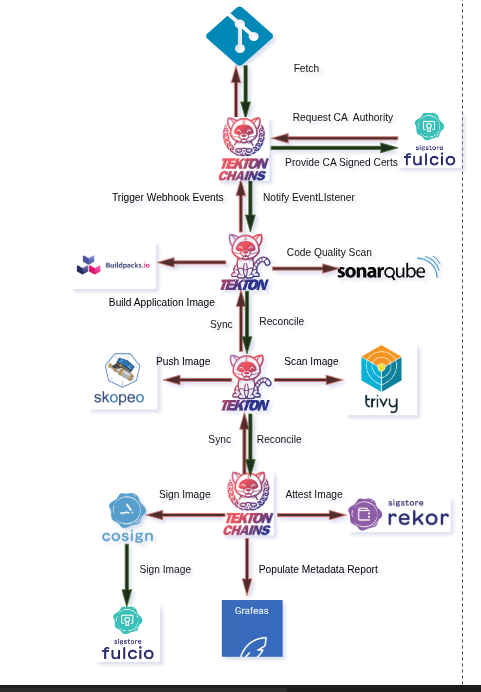

# secure-software-supply-chain

A Kubernetes operator that manages a full software supply chain pipeline from two CRs. Built with Kubebuilder, powered by Tekton, secured by Sigstore.

> "Treat your pipeline as infrastructure, not a script."

---

## Overview

`secure-software-supply-chain` is part of the [BlanketOps](https://github.com/ntlaletsi70) platform engineering project. It implements a supply chain security pipeline as a Kubernetes controller — declarative, auditable, and self-managing.

A `SupplyChain` CR defines the pipeline for a repository. An `ImageBuild` CR is auto-created on every GitHub push via a Tekton EventListener — no manual triggering required. The controller drives a Tekton `PipelineRun` through build, scan, sign, attest, and publish — all reconciled automatically.

```
GitHub Push
    └── EventListener (Tekton Triggers)
            └── creates ──► ImageBuild CR
                                └── owns ──► Tekton PipelineRun
                                                 ├── git-clone             (source fetch)
                                                 ├── authentication-fulcio (OIDC warm-up)
                                                 ├── sonarqube-scanner     (quality gate)
                                                 ├── build-image-buildah   (OCI image build)
                                                 ├── push-image-docker     (registry push)
                                                 ├── vulnerability-scan-trivy (CVE scan)
                                                 ├── sign-image-cosign     (keyless signing)
                                                 └── attest-image-rekor-fulcio (provenance)
```

---

## Architecture



The pipeline is driven end-to-end by two CRs and a set of Tekton Tasks. The controller reconciles the full lifecycle — from webhook registration to signed image attestation.

---

### CRs

**`SupplyChain`** — the pipeline definition for a repository. One per repo. The controller enforces this at reconcile time. It owns and reconciles:
- Custom Tekton Tasks
- TriggerBinding, TriggerTemplate, EventListener (GitHub webhook automation)
- Ingress for the EventListener (host sourced from `spec.webhookHost`)
- The `supply-chain-runner` ServiceAccount

**`GitHubWebhook`** — manages GitHub webhook registration. Automatically registers the webhook URL with GitHub using a GitHub App installation token. Idempotent — safe to apply on every reconcile.

**`ImageBuild`** — a single pipeline execution. Auto-created by the EventListener on every GitHub push. Owns the Tekton `PipelineRun` and tracks per-step status.

**`ImageSignature`** — the cryptographic audit record. Created before the PipelineRun with `Phase=Pending`, updated to `Phase=Signed` on success. Carries the Fulcio cert reference, principal identity, and Rekor log index.

**`ImageBuildResult`** — the durable execution record. Survives PipelineRun pruning. Captures full pipeline step results: git provenance, image digest, Trivy scan summary, SonarQube gate status.

---

### Trigger Layer

The `SupplyChain` controller automatically provisions the full Tekton Triggers stack per chain:

- **TriggerBinding** — extracts `git-repo-url`, `git-revision`, `git-commit-sha`, `short-sha`, `repo-full-name` from the GitHub push payload
- **TriggerTemplate** — creates an `ImageBuild` CR with extracted params. Name is deterministic: `<supplychain>-<branch>-<full-sha>` — idempotent on replay
- **EventListener** — shared across all SupplyChains in the namespace, exposed via nginx Ingress
- **Ingress** — routes `spec.webhookHost` → EventListener. Host updated automatically when `webhookHost` changes

---

### Mediator

The `ImageBuildReconciler` uses a mediator pattern to sequence prerequisites before pipeline construction.

**Gate 1 — Prerequisites**
- Git SSH ExternalSecret reconciliation
- Registry ExternalSecret reconciliation (Buildah + Tekton Chains split credentials)
- SonarQube ExternalSecret reconciliation
- Convergence wait — all secrets must materialise before proceeding

**Gate 2 — Signing Context (three-proof authorization)**

Before Fulcio is called, three SubjectAccessReviews are performed against the `supply-chain-runner` ServiceAccount. All three must pass:

| Proof | Resource | Verb | Meaning |
|-------|----------|------|---------|
| ScopeProof | `supplychains` | `get` | SA can see the chain it claims to execute against |
| IntentProof | `imagebuilds` | `create` | SA is authorized to initiate a build |
| OutputProof | `imagesignatures` | `create` | SA is authorized to produce signing records |

After the image is signed, the three proofs are attested to it with `cosign attest` (predicate type `https://blanketops.dev/attestations/authorization/v1`) by the same keyless identity. The signature says who built the image; the attestation says that identity was authorized, per the API server, at build time. `SupplyChainPolicy` requires both at admission.

After all three SARs pass, a short-lived OIDC token is minted from the ServiceAccount and exchanged with Fulcio for an ephemeral signing certificate. The principal and cert PEM are stored on `ImageBuild.Status` for the terminal block to read back after the PipelineRun completes.

**Gate 3 — PipelineRun**

Builds and creates the Tekton `PipelineRun` with the signing context injected. The `ImageSignature` CR is created at `Phase=Pending` before the PipelineRun starts.

---

### Terminal Actions

When a PipelineRun reaches a terminal state (Succeeded or Failed), the reconciler runs three best-effort actions:

1. **Recorder** — creates or updates an `ImageBuildResult` CR with the full pipeline step results
2. **Signature** — marks the `ImageSignature` as `Signed` (with digest) or `Failed`
3. **Pruner** — deletes old PipelineRuns beyond the retention window (keeps last 3 succeeded, 1 failed)

---

## Install

### 1. Install dependencies

```bash
supplychain install
```

This applies all platform dependencies in order:
- MetalLB (LoadBalancer support for kind)
- Tekton Pipelines, Triggers, Interceptors, Chains, Dashboard, Tasks, Results
- Sigstore (Fulcio, Rekor, Policy Controller)
- NGINX Ingress Controller
- SonarQube

### 2. Bootstrap SonarQube

After `supplychain install` completes and SonarQube is ready:

```bash
supplychain init-sonarqube --new-password <your-password>
```

This automatically:
- Waits for SonarQube to be ready
- Changes the default admin password
- Generates a `supply-chain` user token
- Patches the `ClusterSecretStore` with the token at `/supplychain/sonarqube/token`

### 3. Deploy the operator

```bash
# Build and load into kind
docker build -t blanketops/supply-chain-controller:latest .
kind load docker-image blanketops/supply-chain-controller:latest --name blanketops

# Install CRDs
make install

# Apply RBAC
kubectl apply -f config/rbac/signing_role.yaml
kubectl apply -f config/rbac/eventlistener_role.yaml

# Deploy
make deploy IMG=blanketops/supply-chain-controller:latest
```

### 4. Apply samples

```bash
kubectl apply -k config/samples
```

This applies:
- `ClusterSecretStore` (ESO fake provider with credentials)
- `SupplyChain` CR
- `GitHubWebhook` CR
- `SupplyChainPolicy` CR, and the role its `supply-chain-policy-runner` ServiceAccount needs

---

## Webhook Setup (Tailscale Funnel)

The `GitHubWebhook` controller auto-registers the webhook with GitHub. The `hookURL` must be publicly reachable. We use Tailscale Funnel to expose the in-cluster EventListener without a cloud load balancer.

### Setup

```bash
# Expose the nginx ingress via Tailscale Funnel
tailscale serve --bg --https=443 http://<metallb-ingress-ip>
tailscale funnel --bg 443
```

Set `spec.webhookHost` in the `SupplyChain` CR to your Tailscale hostname:

```yaml
spec:
  webhookHost: your-machine.tailf8145.ts.net
```

The controller automatically updates the EventListener Ingress host and the `GitHubWebhook` CR uses the same URL for webhook registration.

### Persistence (systemd)

To survive reboots, create a systemd service that bridges the MetalLB IP to localhost:

```bash
sudo tee /etc/systemd/system/kind-ingress-bridge.service <<EOF
[Unit]
Description=Bridge localhost to kind ingress-nginx
After=network.target

[Service]
ExecStart=/usr/bin/socat TCP-LISTEN:8888,fork,reuseaddr TCP:<metallb-ip>:80
Restart=always

[Install]
WantedBy=multi-user.target
EOF

sudo systemctl enable --now kind-ingress-bridge
tailscale funnel --bg 8888
```

---

## Usage

### SupplyChain CR

```yaml
apiVersion: supplychain.blanketops.dev/v1alpha1
kind: SupplyChain
metadata:
  name: for-kaniko-app
  namespace: default
spec:
  repository: ntlaletsi70/for-kaniko-app
  serviceAccountName: supply-chain-runner
  webhookHost: your-machine.tailf8145.ts.net
  image:
    registry: docker.io
    name: nkanyezisolutions/for-kaniko-app
    tagStrategy: git-sha
    cloneSecretRef: github-ssh-credentials
    registrySecretRef: registry-credentials
  steps:
    trivy: true
    sign: true
    attest: true
    sonarQube:
      serverURL: http://sonarqube-sonarqube.default.svc.cluster.local:9000
      tokenSecretRef: sonarqube-token
      projectKey: ntlaletsi70_for-kaniko-app
  signing:
    fulcioURL: http://fulcio-server.fulcio-system.svc.cluster.local
    rekorURL: http://rekor-server.rekor-system.svc.cluster.local
    ctLogURL: http://ctlog.ctlog-system.svc/fulcio
```

### GitHubWebhook CR

```yaml
apiVersion: supplychain.blanketops.dev/v1alpha1
kind: GitHubWebhook
metadata:
  name: for-kaniko-app-webhook
  namespace: default
spec:
  repository: ntlaletsi70/for-kaniko-app
  supplyChainRef: for-kaniko-app
  hookURL: https://your-machine.tailf8145.ts.net
  secretRef: github-app-credentials
```

### Push a commit — builds fire automatically

```bash
kubectl get imagebuilds -n default -w
```

Phase transitions: `Pending` → `Running` → `Succeeded`

### Manually trigger a build

```yaml
apiVersion: supplychain.blanketops.dev/v1alpha1
kind: ImageBuild
metadata:
  name: for-kaniko-app-manual-001
  namespace: default
spec:
  supplyChainRef:
    name: for-kaniko-app
  gitRef:
    url: git@github.com:ntlaletsi70/for-kaniko-app.git
    revision: main
  imageTag: manual-001
```

### Inspect results

```bash
# Build status
kubectl get imagebuilds -n default
kubectl describe imagebuild <name>

# Signing audit record
kubectl get imagesignatures -n default

# Durable build result (survives PipelineRun pruning)
kubectl get imagebuildresults -n default

# PipelineRun logs
kubectl get pipelineruns -n default
tkn pipelinerun logs <name> -f
```

### Verify the signed image

```bash
cosign verify \
  --certificate-identity-regexp=".*" \
  --certificate-oidc-issuer="https://kubernetes.default.svc.cluster.local" \
  docker.io/nkanyezisolutions/for-kaniko-app:<sha>
```

### Enforce the signature at admission (SupplyChainPolicy)

`SupplyChainPolicy` is the admission side of a `SupplyChain`. It renders a sigstore
[policy-controller](https://docs.sigstore.dev/policy-controller/overview/) `TrustRoot` and two
`ClusterImagePolicies`, so only images that SupplyChain signed and attested are admitted.

```yaml
apiVersion: supplychain.blanketops.dev/v1alpha1
kind: SupplyChainPolicy
metadata:
  name: for-kaniko-app
spec:
  supplyChainRef:
    name: for-kaniko-app
  mode: enforce   # or warn
  serviceAccountName: supply-chain-policy-runner   # default
  signers:        # optional: defaults to the SupplyChain's ServiceAccount
  - serviceAccountName: supply-chain-runner
  rekor:          # optional: defaults to the SupplyChain's signing.rekorURL
    url: http://rekor-server.rekor-system.svc.cluster.local
```

Like a build, a policy is gated on three SubjectAccessReviews. Its ServiceAccount (`supply-chain-policy-runner`
by default, created by the controller) must pass all three before anything is rendered, and the verdicts are
recorded in `status.authorization`:

| Proof | Resource | Verb | Meaning |
|-------|----------|------|---------|
| Scope | `supplychains` | `get` | SA can read the SupplyChain it sets policy for |
| Intent | `supplychainpolicies` | `create` | SA may declare admission policy for it |
| Output | `clusterimagepolicies` (`policy.sigstore.dev`) | `create` | SA may produce the admission policies |

Grant them with `config/samples/supplychain_v1alpha1_policyrole.yaml`. Until then the policy stays
`Ready=False` with reason `AuthorizationDenied`; policies that were already rendered are left in place.

Only `supplyChainRef` is required; `signers` and `rekor` default to what the SupplyChain signs with, and
`status` reports the resolved signers and the Fulcio, Rekor and CT log endpoints. State `signers` to pin them
or to accept more than one identity.
An image matching the SupplyChain's repository is admitted only if all of this holds:

| Check | Enforced by |
|---|---|
| Signed keylessly, with a Fulcio certificate chaining to this cluster's Fulcio root | `<namespace>-<name>` policy + `TrustRoot` |
| Certificate issued to the SupplyChain's ServiceAccount by the cluster OIDC issuer | `identities` on both policies |
| Certificate carries a CT log proof, and the signature is recorded in Rekor | `TrustRoot` CT log and Rekor keys |
| Carries an authorization attestation, signed the same way, in which the ServiceAccount passed all three SubjectAccessReviews (scope, intent, output) | `<namespace>-<name>-authorization` policy |

Where each input comes from:

| Policy input | Source |
|---|---|
| Image glob | `SupplyChain.spec.image` (`registry/name**`) |
| Signers | `spec.signers`, else `SupplyChain.spec.serviceAccountName` + the cluster OIDC issuer |
| Rekor URL | `spec.rekor`, else `SupplyChain.spec.signing` |
| Fulcio / CT log URLs | `SupplyChain.spec.signing` |
| Fulcio root, Rekor key, CT log key | `blanketops-sigstore-roots` ConfigMap in the same namespace |

`supplychain install` installs policy-controller into `cosign-system`. It only enforces in namespaces
labelled `policy.sigstore.dev/include=true`, so nothing is checked until you opt a namespace in:

```bash
kubectl label namespace <workload-namespace> policy.sigstore.dev/include=true
```

```bash
kubectl get supplychainpolicies -n default -o wide
kubectl get clusterimagepolicies,trustroots
```

### CLI commands

```bash
# Install all dependencies
supplychain install

# Bootstrap SonarQube (run once after install)
supplychain init-sonarqube --new-password <password>

# Check dependency status
supplychain status

# Remove all dependencies
supplychain uninstall

# Open supply chain dashboard
supplychain observe

# Open RBAC audit dashboard
supplychain observe rbac
```

---

## Uninstall

```bash
make undeploy
make uninstall
supplychain uninstall
```

---

## API Group

`supplychain.blanketops.dev/v1alpha1`

**Resources:** `SupplyChain`, `GitHubWebhook`, `ImageBuild`, `ImageSignature`, `ImageBuildResult`, `SupplyChainPolicy`

---

## Part of BlanketOps

This operator is one component of the BlanketOps platform:

- [blanketops-environments-controller](https://github.com/ntlaletsi70) — environment orchestration
- [blanketops-environments-supply-chain](https://github.com/ntlaletsi70/secure-software-supply-chain) — supply chain pipeline (this repo)
- [blanketops-zenith-runners-pool](https://github.com/ntlaletsi70) — GitHub Actions self-hosted runners

---

## Acknowledgements

- [Tekton](https://tekton.dev)
- [Tekton Triggers](https://tekton.dev/docs/triggers)
- [Tekton Chains](https://tekton.dev/docs/chains)
- [Cosign / Sigstore](https://sigstore.dev)
- [Fulcio](https://github.com/sigstore/fulcio)
- [Rekor](https://github.com/sigstore/rekor)
- [Buildah](https://buildah.io)
- [Skopeo](https://github.com/containers/skopeo)
- [Trivy](https://aquasecurity.github.io/trivy)
- [SonarQube](https://www.sonarqube.org)
- [Policy Controller](https://github.com/sigstore/policy-controller)
- [Kubebuilder](https://book.kubebuilder.io)
- [External Secrets Operator](https://external-secrets.io)
- [Tailscale Funnel](https://tailscale.com/kb/1223/funnel)

---

## Demo

| Demo | Description |
|------|-------------|
| Full Pipeline | GitHub push → ImageBuild → PipelineRun → Signed image |
| Setup | Fresh cluster setup: install deps, apply SupplyChain CR |
| Webhook Automation | GitHubWebhook CR: auto-register → push → pipeline fires |
| Signing Verification | Verify signed image with cosign + Rekor transparency log |

*See [`demo/`](demo/) for scripts and tape files.*# secure-software-supplychain
