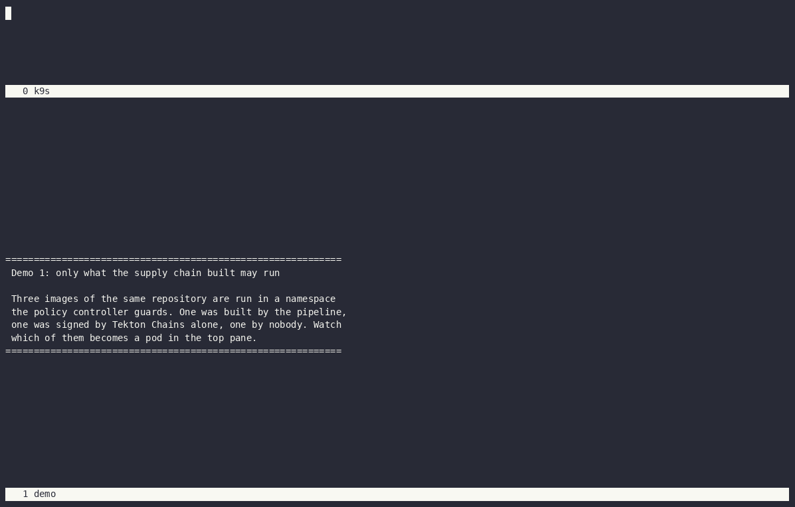
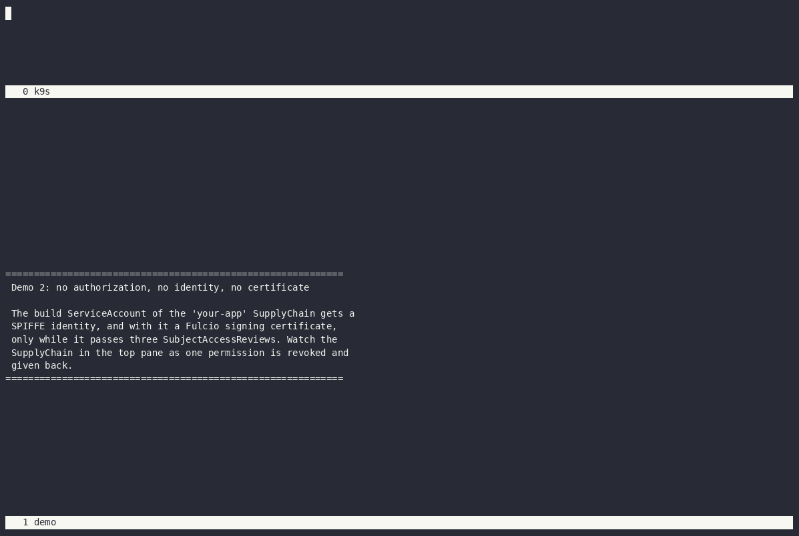
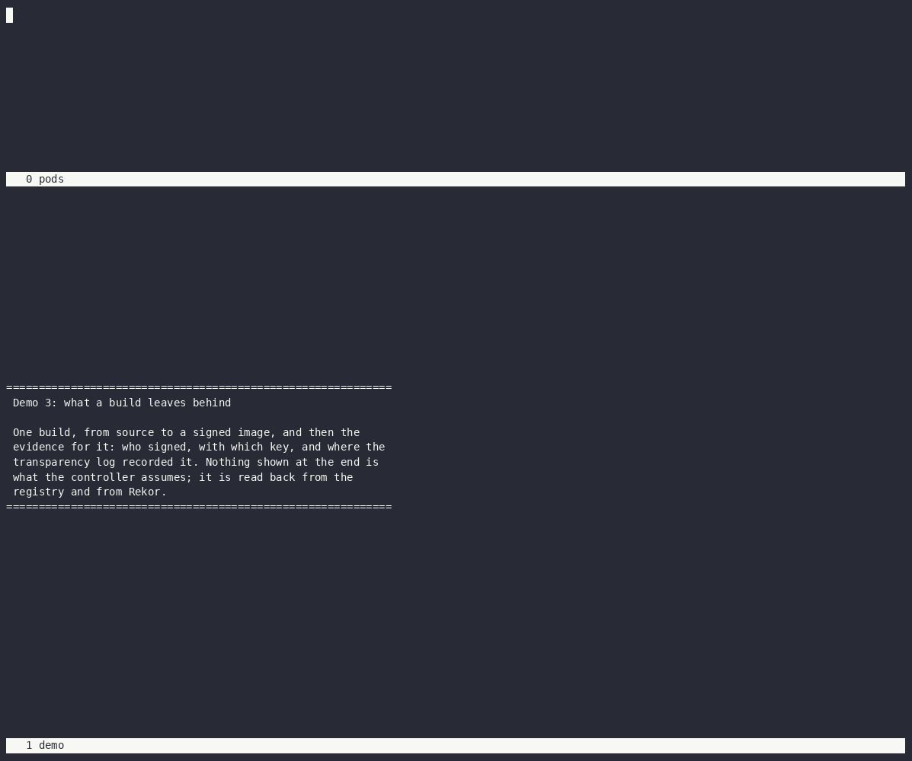
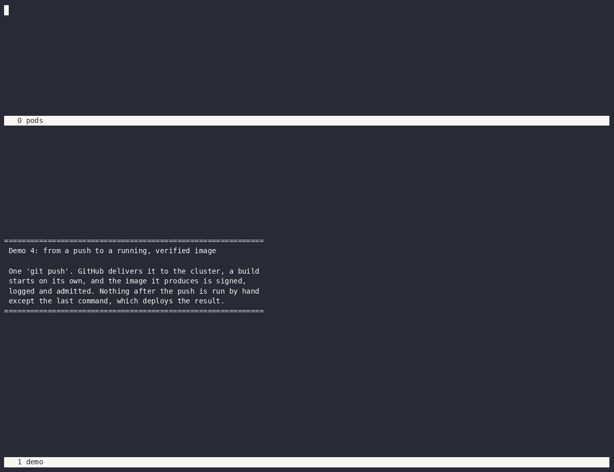
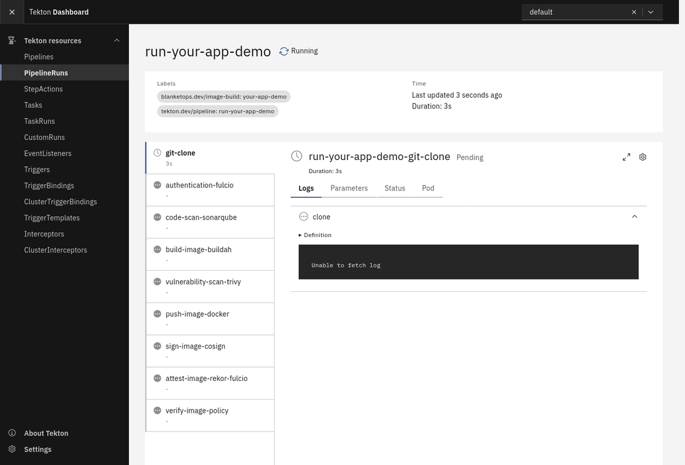

# Demos

[← Back to the README](../README.md)

Recordings of the real thing. Demos 1 to 4 are terminal recordings, each a scripted run of ordinary commands
against a live cluster: a pane on top watching the cluster, the script below it. They are recorded with
[asciinema](https://asciinema.org) and rendered with [agg](https://github.com/asciinema/agg) inside a `screen`
split, in the same style as [knative-ctl](https://github.com/ntlaletsi70/knative-ctl). Demo 5 is a browser:
the Tekton Dashboard, photographed every few seconds while a build runs.

| Demo | Shows | Plays in |
|---|---|---|
| [1. Only what the supply chain built may run](#demo-1-only-what-the-supply-chain-built-may-run) | Admission: one image admitted, two refused | about 50 s |
| [2. No authorization, no identity, no certificate](#demo-2-no-authorization-no-identity-no-certificate) | A permission revoked and restored, and what Fulcio does each time | about 80 s |
| [3. What a build leaves behind](#demo-3-what-a-build-leaves-behind) | A build from source to signed image, then its evidence | about 90 s |
| [4. From a push to a running, verified image](#demo-4-from-a-push-to-a-running-verified-image) | One `git push`, a build that starts on its own, and the image admitted | about 75 s |
| [5. A build, live in the Tekton Dashboard](#demo-5-a-build-live-in-the-tekton-dashboard) | The nine steps of a successful run in Tekton's own UI | about 40 s |

## Recording them yourself

Every script is in this directory, so each recording can be made again on your own cluster. You need:

- the stack [installed](../docs/installation.md) with `--signing-identity spiffe`, and the operator deployed;
- `asciinema`, `agg`, `screen` and `k9s`, plus `python3`, `openssl` and `curl` for the scripts.

Each demo has a `run-demo.sh` (the bottom pane), a `screenrc` (the layout) and, where it needs objects of its
own, a `setup.yaml`. The commands below are run from the root of the repository. `--idle-time-limit 2` caps
every pause at two seconds when the GIF is rendered; the `.cast` file keeps the real timing.

Demos 1, 3 and 4 use real images and real builds. Their scripts display the image repository, the git repository
and the `SupplyChain`'s name as `your-dockerhub-user/your-app`, `your-org/your-app` and `your-app`; the `mask`
function in each script is the only thing that changes what is shown.

## Demo 1: only what the supply chain built may run



Three images of one repository are run in a namespace the policy controller guards. The image the pipeline
built, signed by the build and by Tekton Chains, is admitted and becomes a pod (top pane). An image signed by
Chains alone is refused by the policy that wants the build's own signature. An image pushed by hand is refused
by all four policies, each named with its reason.

It needs three images in the repository of one of your `SupplyChain`s: one the pipeline built, one that only
Tekton Chains signed, and one pushed by hand.

```bash
kubectl apply -f demo/1-admission/setup.yaml

export REPO=docker.io/<user>/<app> APP=<supplychain> \
       SIGNED_TAG=<tag> CHAINS_ONLY_TAG=<tag> UNSIGNED_TAG=<tag>
asciinema rec demo/1-admission/demo.cast -c "screen -c demo/1-admission/screenrc"
agg --idle-time-limit 2 demo/1-admission/demo.cast demo/1-admission/demo.gif
```

## Demo 2: no authorization, no identity, no certificate



The `your-app` SupplyChain's build ServiceAccount passes its three reviews, so SPIRE gives a pod running as it
an identity and Fulcio issues that identity a signing certificate. Another ServiceAccount in the same namespace
gets no identity, and Fulcio will not take its Kubernetes token instead. Deleting the RoleBinding that grants
the three permissions turns the SupplyChain `Unauthorized` at once (top pane), and the same pod is refused an
identity. Putting the RoleBinding back restores both.

It builds nothing, so it needs no images and no credentials: `setup.yaml` creates a `SupplyChain` in a namespace
of its own.

```bash
kubectl apply -f demo/2-revoke-identity/setup.yaml

asciinema rec demo/2-revoke-identity/demo.cast -c "screen -c demo/2-revoke-identity/screenrc"
agg --idle-time-limit 2 demo/2-revoke-identity/demo.cast demo/2-revoke-identity/demo.gif
```

`ask-fulcio.sh` makes the same certificate request a signing step does and prints one line per outcome; it
never prints a token or a key.

## Demo 3: what a build leaves behind



One real build, start to finish: an `ImageBuild` is applied, the nine steps run as pods (top pane), and the last
step prints what it verified. Then the evidence, read back from the registry and Rekor rather than assumed:

- the `ImageSignature`, whose Rekor index is the one cosign printed inside the build and the one Rekor holds an
  entry at;
- the `ImageBuildResult`, listing all seven signatures and attestations with their signer, key and log index,
  complete once Tekton Chains has signed the finished run;
- the same record in Tekton, as a `CustomRun`.

The build takes about four minutes; rendered with the two-second cap it plays in about a minute and a half. The
top pane is a plain pod list rather than `k9s`, because the pods are named after the `SupplyChain` and have to go
through the same placeholder.

It needs a working `SupplyChain` whose repository builds cleanly.

```bash
export APP=<supplychain> REPO=docker.io/<user>/<app> GIT_REPO=<org>/<repo> REVISION=<branch>
asciinema rec demo/3-evidence/demo.cast -c "screen -c demo/3-evidence/screenrc"
agg --idle-time-limit 2 demo/3-evidence/demo.cast demo/3-evidence/demo.gif
```

## Demo 4: from a push to a running, verified image



An empty commit is pushed to a branch the `SupplyChain` builds. GitHub delivers the push to the cluster through
[Tailscale Funnel](../docs/installation.md#6-make-the-webhook-reachable-tailscale-funnel), an `ImageBuild` named
after the branch and the commit appears, and its pipeline runs, one pod per step (top pane). The `ImageSignature`
then shows the build's signature with its Rekor index, and the image is run in a guarded namespace and admitted.
Nothing after the push is started by hand except that last `kubectl run`.

It needs the webhook reachable, a clone of the repository you can push from, and the `admission-demo` namespace
from demo 1. Every recording pushes one empty commit to the branch.

```bash
kubectl apply -f demo/1-admission/setup.yaml

export APP=<supplychain> REPO=docker.io/<user>/<app> GIT_REPO=<org>/<repo> \
       BRANCH=<branch> CLONE=<path to your clone>
asciinema rec demo/4-push-to-build/demo.cast -c "screen -c demo/4-push-to-build/screenrc"
agg --idle-time-limit 2 demo/4-push-to-build/demo.cast demo/4-push-to-build/demo.gif
```

The build depends on the registry being reachable throughout: a dropped request while cosign stores the
signature fails the sign step, and the recording with it.

## Demo 5: a build, live in the Tekton Dashboard



A successful run as Tekton shows it: the nine tasks of the pipeline, each turning green as it finishes, with the
logs of whichever one is running. It ends on the last step's report: the image, who signed it, and that the
build's signature and authorization and Tekton Chains' signature and provenance all verified.

It is a time-lapse, not a screen recording. One frame is taken every few seconds over a build of about three
minutes, and each frame is a fresh load of the page, opened on the task running at that moment.

The dashboard shows the names of real runs, repositories and images, and a web page cannot be passed through
`sed`. So the browser reaches the dashboard through `mask-proxy.py`, a small reverse proxy that replaces each
real name with its placeholder in everything the dashboard returns, and back again in what the browser asks
for. The dashboard itself is untouched.

It needs `firefox`, and `python3` with [Pillow](https://python-pillow.org) for assembling the GIF. Firefox is
driven over Marionette, its built-in remote-control protocol; `firefox.py` is the few dozen lines of it that are
needed, so there is no browser driver to install.

```bash
export APP=<supplychain> GIT_REPO=<org>/<repo> REVISION=<branch>
export MAPS="--map <registry-user>/<app>=your-dockerhub-user/your-app --map <org>/<repo>=your-org/your-app --map <supplychain>=your-app"
demo/5-tekton-dashboard/record.sh
```

`MAPS` lists every real name and what to show instead, longer names first. Leave it empty to record the
dashboard as it is.
