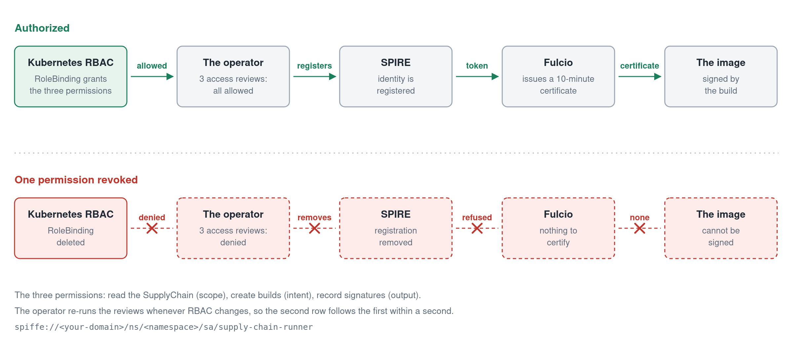
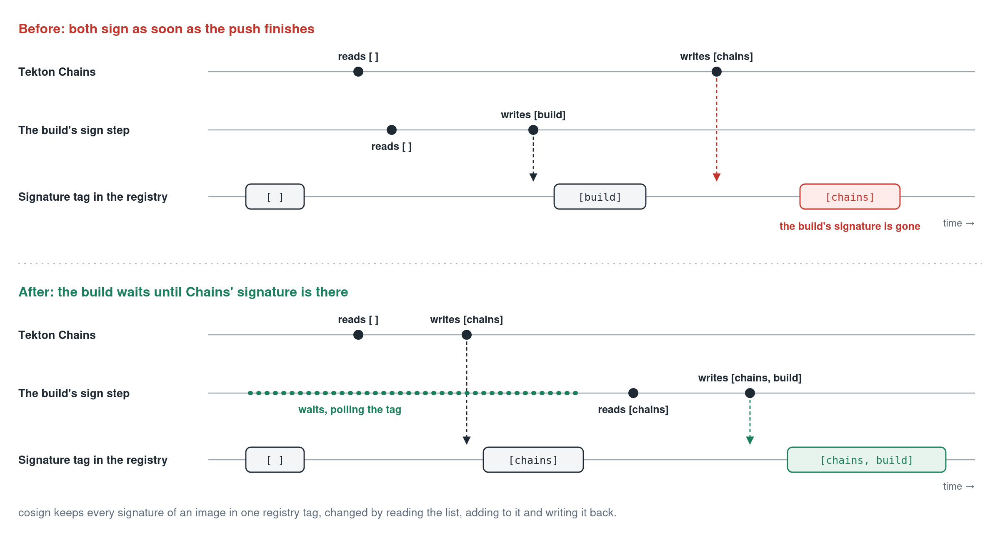

<!--
Draft for Medium, part 1 of 2. Medium has no tables, so this uses lists and code blocks only.
Images: Medium takes no SVG. Upload the PNGs from docs/articles/diagrams/ and the GIFs from demo/;
the caption for each is the italic line under it.
-->

# Keyless signing answers "which key?". It does not answer "who gets to sign?"

*Part 1 of 2 on building a software supply chain on Kubernetes with Tekton, Sigstore and SPIFFE. Part 2 covers admission and evidence.*

Keyless signing with Sigstore removes the worst part of signing container images: there is no long-lived private key to store, rotate or leak. A build proves who it is, a certificate authority called Fulcio issues it a certificate that lasts ten minutes, the build signs, and the key is thrown away.

That moves the question. If a certificate is issued to whoever can prove an identity, then everything depends on who is given one.

On the cluster this series is about, I checked. I took the Kubernetes token of the `default` ServiceAccount, the one every pod gets without asking, presented it to our own Fulcio, and got back a valid signing certificate. Nothing was misconfigured. That is simply what "trust the cluster's ServiceAccount tokens" means.

This article is about closing that gap: making a signing identity something a build has to be authorized for, and taking it away the moment the authorization goes.

The code is at [github.com/BlanketOps/secure-software-supplychain](https://github.com/BlanketOps/secure-software-supplychain). It is a proof of concept that runs end to end on a single-node kind cluster, and I will say where its limits are.

## The setup, briefly

A Kubernetes operator turns a `git push` into an image that is built, scanned, signed and verified. You declare a `SupplyChain` for a repository, and a push starts a Tekton pipeline of nine steps: clone, check the signing identity, static analysis, build, vulnerability scan, push, sign, hand over to Tekton Chains, verify.

Fulcio (the certificate authority) and Rekor (the transparency log) run inside the cluster, along with Tekton Chains, which signs every run and records where it came from.

## What happens when a build signs

It helps to be exact about the exchange, because it is often described as "getting a key from Fulcio". Nobody gets a key from Fulcio.

1. The signing step makes a throwaway key pair. The private key never leaves the pod.
2. It obtains a token that says who it is.
3. It sends Fulcio the token, the public key, and proof that it holds the private key.
4. Fulcio checks the token with the issuer it came from and returns a certificate, valid for about ten minutes, that binds the public key to the identity. The certificate is recorded in a certificate transparency log.
5. The step signs the image. The signature and certificate go to Rekor, and the private key is discarded.

Later, anyone verifying the image checks three things: the certificate chains to the Fulcio root they trust, the identity in it is one they expect, and Rekor shows the signature was made while the certificate was still valid.

Step 2 is where the trouble is.

## A ServiceAccount token is not much of a credential

The simplest token a pod can present is its own Kubernetes ServiceAccount token. Fulcio supports this directly: you tell it to trust the cluster's API server as an issuer.

But every pod has such a token. If Fulcio trusts the cluster's issuer, then every workload in the cluster can obtain a signing certificate, in its own name, at any time. Verification still protects you, because a policy that only accepts the build's identity will reject a signature made as `default`. But your certificate authority is now issuing certificates to anything that asks, and the only thing between an attacker and a valid signature is which name they can run as.

I wanted the certificate itself to mean something: that the identity it names was allowed to build.

## SPIFFE: an identity that has to be registered

[SPIFFE](https://spiffe.io) is a standard for workload identity, and SPIRE is its reference implementation. A workload asks a local agent for its identity over a Unix socket and receives a short-lived token naming it, such as `spiffe://your-domain/ns/default/sa/supply-chain-runner`.

The property that matters here is that SPIRE only hands out identities that have been **registered**. No registration, no identity, and the request is refused.

SPIRE's Helm chart ships a default rule that registers every pod in the cluster. That reproduces the problem exactly, so the installer leaves it out. What remains are two kinds of registration:

- Tekton Chains' controller, registered once at install.
- A `SupplyChain`'s build ServiceAccount, registered by the operator, and only on a condition.

## Three questions asked of the API server

The condition is that the build ServiceAccount passes three `SubjectAccessReview`s. A SubjectAccessReview asks the Kubernetes API server a plain question: may this identity do this? The three questions are:

- **Scope:** may it read the `SupplyChain` it builds for?
- **Intent:** may it create builds?
- **Output:** may it record the signatures it makes?

If all three come back allowed, the operator registers the identity with SPIRE. If any comes back denied, it removes the registration and marks the `SupplyChain` as `Unauthorized`, with the three answers in its status (abridged):

```yaml
status:
  phase: Ready
  signingIdentity: spiffe://your-domain/ns/demo/sa/supply-chain-runner
  authorization:
    scope:  { resource: supplychains,    verb: get,    allowed: true }
    intent: { resource: imagebuilds,     verb: create, allowed: true }
    output: { resource: imagesignatures, verb: create, allowed: true }
```

The chain is now: RBAC says the ServiceAccount may build, so SPIRE will name it, so Fulcio will certify it. Break the first link and the others go with it.



*A signing identity exists only while RBAC allows the build ServiceAccount. Remove the permission and nothing downstream can happen.*

The same three answers are also attached to every image as a signed attestation, so admission can require proof that the build was authorized and not only that it was signed. That is part 2.

## Revocation has to be immediate

The first version re-ran the three checks every five minutes. That means a revoked permission could keep signing for up to five minutes, which is not what "revoked" should mean.

The operator now watches Roles, RoleBindings, ClusterRoles and ClusterRoleBindings, and re-runs the checks whenever any of them changes. Measured on the test cluster, deleting the RoleBinding turned the `SupplyChain` `Unauthorized` in about a tenth of a second. The five-minute check stays as a backstop for permissions granted some other way.


*A permission revoked and restored. Top: the SupplyChain. Bottom: what SPIRE and Fulcio answer each time.*

In the recording, a pod running as the build ServiceAccount gets an identity and a certificate. Another ServiceAccount in the same namespace gets neither. Then the RoleBinding is deleted, and the same pod, running as the same ServiceAccount, is refused.

## Closing the side door

There was still the gap from the opening. With SPIRE in place, Fulcio trusted two issuers: SPIRE, and the cluster's own API server. The second was there because the operator used to request a certificate for itself before each build, using a ServiceAccount token.

That certificate never signed anything. It existed, it was stored on the build's status under a name that said it was "the certificate used for signing", and it kept the side door open. Removing it did three things at once:

- Fulcio now trusts exactly one issuer, SPIRE. A Kubernetes token gets `There was an error processing the identity token`.
- The operator lost its permission to mint tokens for ServiceAccounts, which it no longer has any use for.
- No build pod carries a Kubernetes token addressed to Fulcio.

A principle fell out of this: **the controller should hold no signing material at all.** The steps that sign get their own certificate, inside the build, as the build.

## Two signers, and a race between them

Tekton Chains signs too. When a pipeline finishes a task that produced an image, Chains signs the image and records SLSA provenance for it, under its own SPIFFE identity. So each image ends up vouched for by two independent identities: the build, which says "I was authorized", and Chains, which says "this is how it was built".

Getting both signatures onto the image took longer than expected. The first builds verified against Chains' signature only; the build's own had vanished.

Signatures made with cosign are stored in the registry under a tag derived from the image digest. Adding one means reading the list that is there, appending, and writing it back. Chains signs the instant the push task completes, which is the same moment the pipeline's signing step starts. Two writers read the same empty list, and the second write replaces the first.



*Both signers read an empty list, so the second write replaces the first. Making the build wait keeps both signatures.*

The fix is ordering. The signing step now waits until Chains' signature is in the registry before it adds its own. It is one small step in the pipeline, and it would be easy never to notice it was needed: the build reported success either way.

## What this does not do

It would be wrong to oversell this.

- It runs on one kind cluster. Credentials are kept in a Vault the installer runs, whose unseal key lives in the same cluster so it can restart unattended. That is fine for a demonstration and not for production.
- Fulcio, Rekor and SPIRE's OIDC discovery are reached over plain HTTP inside the cluster.
- Anyone who can create a pod running as the build ServiceAccount gets its identity. The three checks decide whether that ServiceAccount has an identity at all; they do not decide who may run as it. That is ordinary Kubernetes RBAC, and it has to be right.
- A registered identity can be used for as long as it stays registered, not only during a build.

What it does do is make the certificate carry a fact: at the time this was signed, the cluster's own authorization said this identity was allowed to build.

## Next

Part 2 is about the other side: what the cluster accepts at admission, and how to prove afterwards what was signed. That turned out to hold the larger surprises, including a record that said `Signed` about a signature it had never looked at, and an installer that quietly replaced the transparency log.
