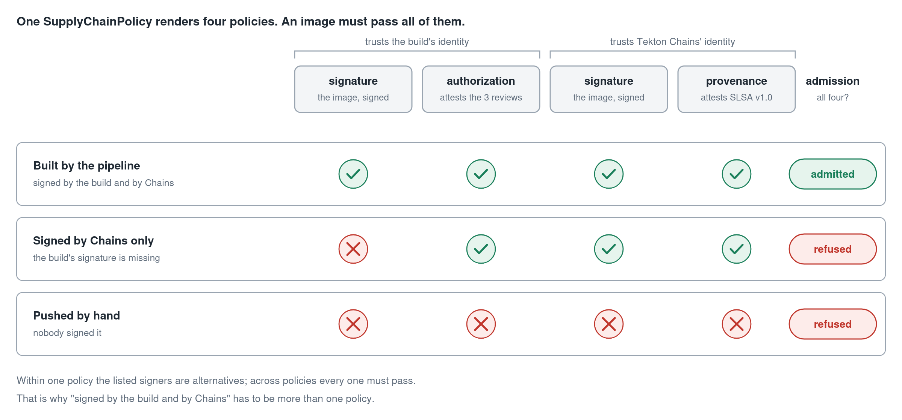
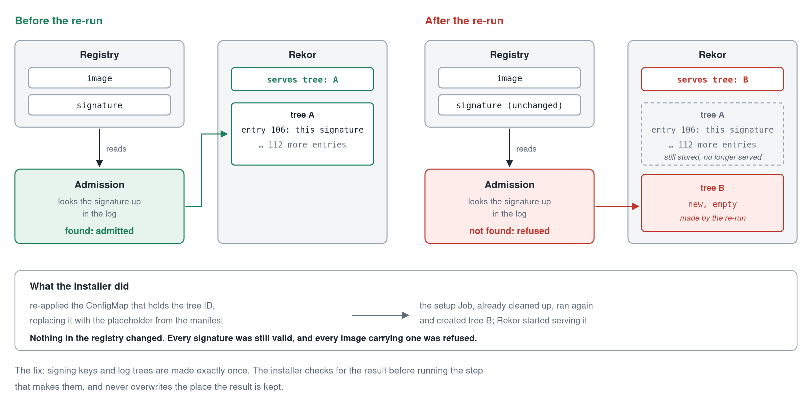

<!--
Draft for Medium, part 2 of 2. Medium has no tables, so this uses lists and code blocks only.
Images: Medium takes no SVG. Upload the PNGs from docs/articles/diagrams/ and the GIFs from demo/;
the caption for each is the italic line under it.
-->

# A record that said "Signed" had never looked at the signature

*Part 2 of 2 on building a software supply chain on Kubernetes with Tekton, Sigstore and SPIFFE. [Part 1](LINK-TO-PART-1) covered who is allowed to sign.*

Part 1 ended with every image carrying proof from two identities: the build, which signs and attests that it was authorized, and Tekton Chains, which signs and attests how the image was built.

Signatures are only worth something if two more things hold. Something has to refuse images that lack them, and you have to be able to show, later, what was actually signed. This part is about both, and about three places where the system looked correct and was not.

The code is at [github.com/BlanketOps/secure-software-supplychain](https://github.com/BlanketOps/secure-software-supplychain).

## Admission: four requirements, all of them

The gate is Sigstore's policy controller, an admission webhook that checks an image's signatures before a pod may be created. It is configured with `ClusterImagePolicy` resources. Two rules about them shape everything:

- Within one policy, the listed signers are alternatives. Any one of them satisfies it.
- Across policies that match the same image, all must pass.

So "signed by the build **and** by Chains" cannot be one policy. It has to be several. For each `SupplyChain` you write one `SupplyChainPolicy`, and the operator renders four policies from it:

- the build's **signature** on the image;
- the build's **authorization attestation**, checked against a rule that all three access reviews were allowed, for this ServiceAccount;
- Chains' **signature** on the image;
- Chains' **SLSA provenance** attestation.

An image must pass every one. Neither identity can vouch for an image alone.



*Four separate requirements, two per identity. An image missing any one is refused.*


*Three images of the same repository. One becomes a pod.*

In the recording, three images of the same repository are run in a guarded namespace. The one the pipeline built is admitted. One that only Chains signed is refused, and the message names the policy that wanted the build's own signature. One pushed by hand is refused by all four.

The second case is not contrived. It is what the race from part 1 produced: for a while, every image the pipeline built was a Chains-only image, and with only a signature policy for Chains it would have sailed through.

## Pin what you trust

Each policy verifies against a trust root: the Fulcio root certificate, Rekor's public key, and the certificate transparency log's key. These are stated explicitly, with their fingerprints shown on the policy's status, so that "which Fulcio signed this?" has an answer you can read.

I tested the pinning the direct way, by swapping each of the three for a wrong key in turn. Each swap alone was enough to get a correctly signed image refused. That is the behaviour you want, and it is worth seeing once rather than assuming.

The last step of every build runs the same verification against the image it just published. A build that produced something admission would refuse fails as a build, where someone is looking, instead of at deploy time.

## The record that had not looked

The operator keeps an `ImageSignature` for each build: who signed, with which certificate, and the index of the signature's entry in Rekor. It is the kind of record an auditor asks for.

Reading the code behind it, four of its fields were not what they claimed.

- **The Rekor index** was "the most recent entry in the log" at the moment the build finished. With Chains also writing to the log, that was usually someone else's entry.
- **The certificate** was one the operator had requested for itself. It had never signed the image.
- **The signing time** was when the operator noticed the pipeline had finished.
- **The phase** became `Signed` whenever the pipeline succeeded.

None of it was read from the signature. All of it was the controller writing down what it expected to be true. And during the race described in part 1, when the build's signature was being overwritten, this record said `Signed` every time.

The fix was to stop inferring and go and look. The signatures are in the registry, each carrying its certificate. The log entries are in Rekor, and can be found by the hash of what was signed. So the operator now reads both back, and the record is filled in from what it finds:

```yaml
status:
  phase: Signed
  subject: spiffe://your-domain/ns/default/sa/supply-chain-runner
  rekorLogIndex: 106
  signedAt: "2026-10-06T07:01:13Z"
  certificateFingerprint: sha256:49402e79…
```

It becomes `Signed` only when the build's signature and its log entry are both found. If the pipeline succeeded but the signature cannot be read, it stays `Pending` and says why.

I checked one against two independent sources. The signing step's own log printed `tlog entry created with index: 106`. Rekor's entry 106 is a signature entry whose timestamp equals the recorded signing time to the second.

The general point is small and easy to get wrong: **a status field should report an observation, not a hope.** "The pipeline succeeded" and "the image is signed" are different facts, and only one of them was being checked.


*One build, then the evidence for it, read back from the registry and the log.*

The same reading-back produces the build's full evidence: every signature and attestation on the image, who made it, with which key, and where it is logged. A typical build leaves seven entries.

## Putting the result inside the pipeline cost the provenance

It seemed natural to make the result part of the build: a last pipeline task that writes the record, so that it shows up in Tekton next to the steps that produced it. Tekton supports this with custom tasks, which hand a step to your own controller.

It worked, and it silently removed something. Tekton Chains stopped signing the pipeline run.

Chains signs a run only after all of its children have been signed, and it looks each child up as a `TaskRun`. A custom task is not a `TaskRun`. Chains fails to find it and gives up on the whole run, without an error anyone would see. The per-task signatures were still made, so the image still verified. The run-level provenance, the document describing the whole build, was simply never produced. The latest Chains source has the same logic.

The record is now published to Tekton as a separate run, created after the build and Chains are both finished. It appears in the same tooling, and Chains is undisturbed.

I only found this because a check for "did Chains sign the run?" was already in the test script. Without it, the build was green.

## The installer that started a new log

The most damaging bug was in the installer, and I missed it the first time it happened.

Rekor stores its log in a Merkle tree. The tree is created once by a setup job, which writes the tree's ID into a ConfigMap. The manifest for that ConfigMap ships with a placeholder, with a comment explaining that this is so re-applying it will not overwrite the ID.

Our installer re-applied it by replacing the whole object. The ID was erased, the setup job ran again, and Rekor began serving a new, empty tree.



*Nothing in the registry changed. The log it was recorded in was no longer the one being served.*

Every signature made before that was still in the registry, still valid, and now "not found in the transparency log". Every image carrying one was refused at admission. It happened on any re-run of the installer, and the first time I blamed something else.

There were two more of the same family. Rekor was configured with an in-memory signing key, so it made a new one on every restart and stopped matching the trust root. And the jobs that generate Fulcio's keys ran again on a re-run, replacing keys that everything already trusted.

The rule that came out of it: **some things in a signing system are made exactly once.** Signing keys and log trees are in that set. An installer has to know which of its steps are in it, check for the result before running them, and never overwrite the place the result is kept.

A transparency log that can be swapped out by re-running an install script is not doing its job, and nothing about a healthy-looking cluster will tell you it happened.

## From a push to a running image


*One git push. Nothing after it is started by hand.*

Put together: a push reaches the cluster through a Tailscale Funnel, a build starts on its own, the image is signed by two identities and logged, and the admission policy accepts it.

## Limits

- This is a proof of concept on one kind cluster, with a Vault whose unseal key is kept in the same cluster, and plain HTTP between the in-cluster services.
- Admission reads the image's signatures from the registry for each of the four policies, and the webhook fails closed after ten seconds. On a slow link to the registry it can time out, and the answer is to ask again. Failing closed is the right default; the latency is a cost of requiring four proofs.
- The provenance Chains produces is SLSA v1.0, and admission requires it. I am not claiming a SLSA build level: that depends on properties of the build platform this setup does not establish, such as isolation between builds.
- The evidence is read back from a registry and a log the cluster itself runs. It shows what was signed and logged. It does not make the cluster's own operators untrusted parties.

## What I would keep

Three things outlast this particular stack.

Give a build an identity it has to be authorized for, and take it away when the authorization goes. Require proof from more than one identity, and make sure each requirement is a separate one. And write down only what you have gone and looked at, because the system that looks finished and the system that is correct were, three times in this project, not the same system.
